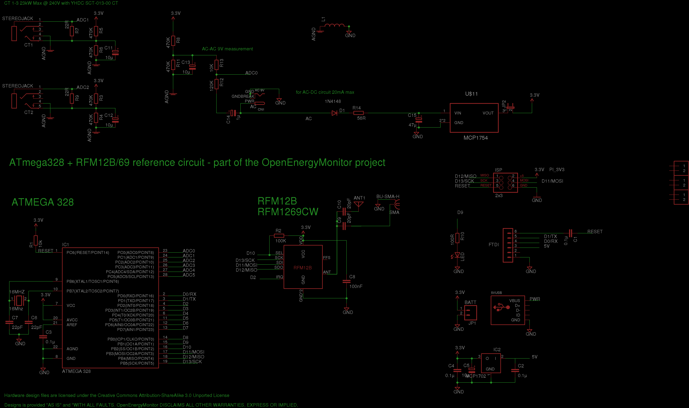
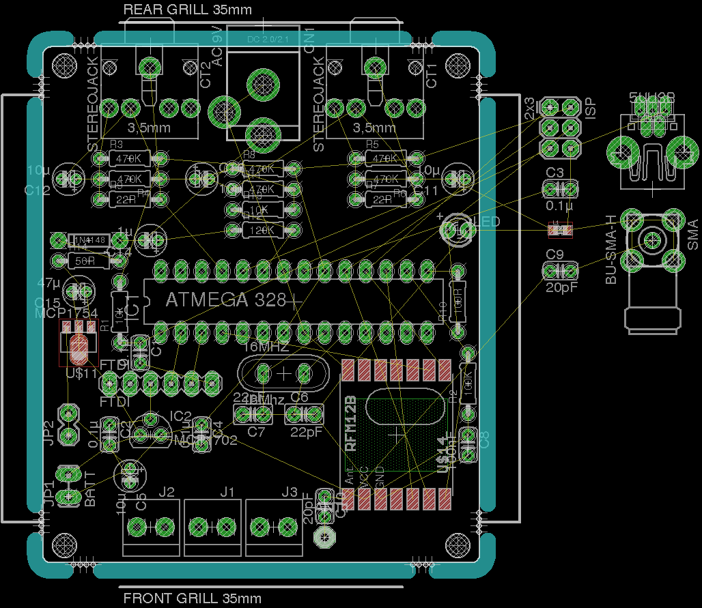

## EmonTx Through Hole

An initial concept of an update to the emontx v2 through hole design with powered by AC-AC, 2 CT's, EmonTx v3 style sockets and EmonTH Case.

### Eagle schematic and board file

Download both the schematic and board file and open in eagle, click on File > Switch to Board to navigate between schematic view and PCB Board view.

- Schematic: [AtmegaRFM69_through_hole.sch](AtmegaRFM69_through_hole.sch)
- Board: [AtmegaRFM69_through_hole.brd](AtmegaRFM69_through_hole.brd)

### Schematic

### Board

### Open Hardware

Hardware designs (schematics and CAD) files are licensed under the [Creative Commons Attribution-ShareAlike 3.0 Unported License](http://creativecommons.org/licenses/by-sa/3.0/) and follow the terms of the [OSHW (Open-source hardware) Statement of Principles 1.0.](http://freedomdefined.org/OSHW)
