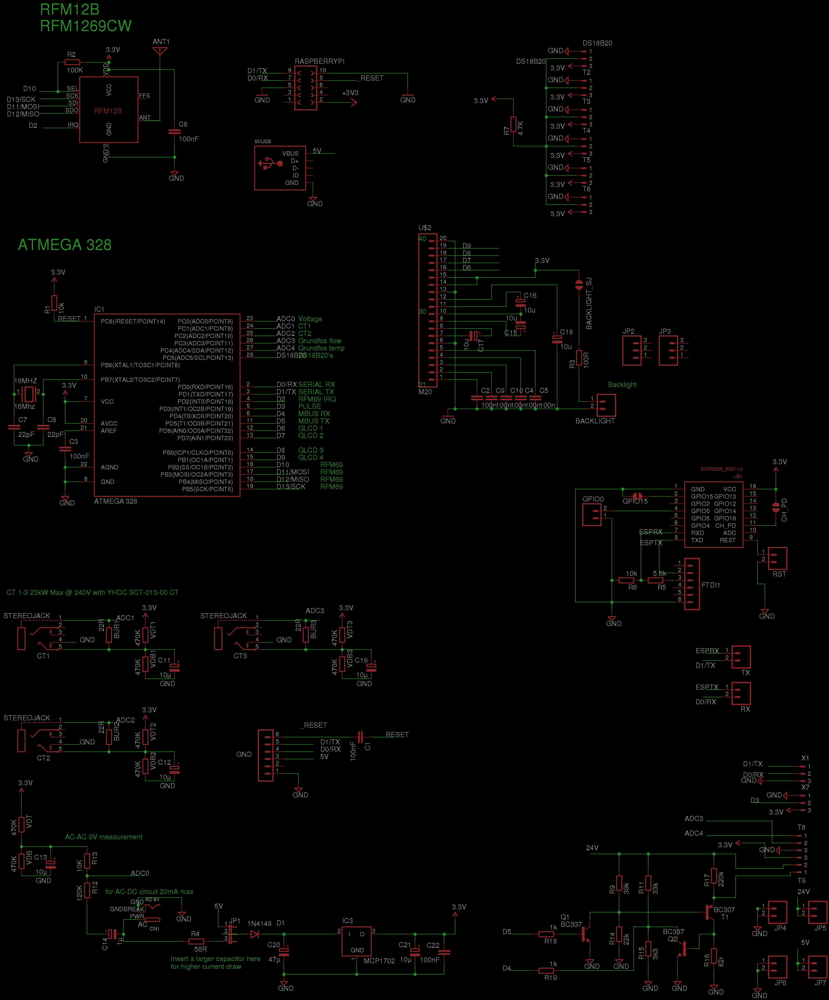
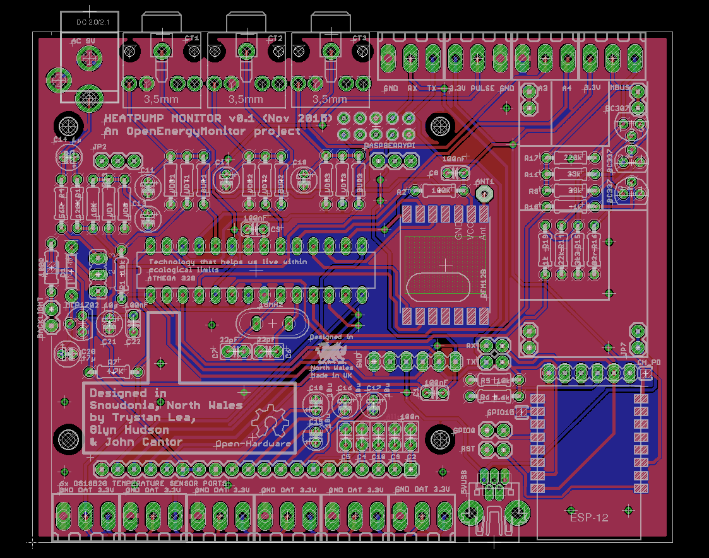

# Heatpump monitor

This is a new design for a dedicated open source heatpump monitoring board with support for the reading of a kamstrup heatmeter or/and grundfos vortex flow sensor on board in addition to DS18B20 based temperature sensing and standard OpenEnergyMonitor electrictiy monitoring with CT current + ACAC voltage sensing.

In addition this board supports the esp-12 wifi module, raspberrypi gpio and a emonglcd display as optional extras.

This board is currently going through initial testing, if your interested in this unit and heatpump monitoring please get in contact: trystanlea@openenergymonitor.org

## Schematic

[HeatpumpMonitor.brd](HeatpumpMonitor.brd)

## Board

[HeatpumpMonitor.sch](HeatpumpMonitor.sch)

The hardware design (schematics, board files and gerber) files are licensed under the [Creative Commons Attribution-ShareAlike 3.0 Unported License](http://creativecommons.org/licenses/by-sa/3.0/) and follow the terms of the [OSHW (Open-source hardware) Statement of Principles 1.0.](http://freedomdefined.org/OSHW)

