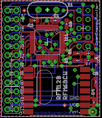

## RFM2Pi V3

http://wiki.openenergymonitor.org/index.php?title=RFM12Pi_V3

### Schematic and board files: 

See board folder

### Schematic

Download schematic: [https://github.com/openenergymonitor/RFM2Pi/blob/master/board/v2/RFM2Pi_v2.6.sch](https://github.com/openenergymonitor/RFM2Pi/blob/master/board/v2/RFM2Pi_v2.6.sch)

### Board

Download board: [https://github.com/openenergymonitor/RFM2Pi/blob/master/board/v2/RFM2Pi_v2.6.brd](https://github.com/openenergymonitor/RFM2Pi/blob/master/board/v2/RFM2Pi_v2.6.brd)

### Open Hardware

Hardware designs (schematics and CAD) files are licensed under the [Creative Commons Attribution-ShareAlike 3.0 Unported License](http://creativecommons.org/licenses/by-sa/3.0/) and follow the terms of the [OSHW (Open-source hardware) Statement of Principles 1.0.](http://freedomdefined.org/OSHW)
