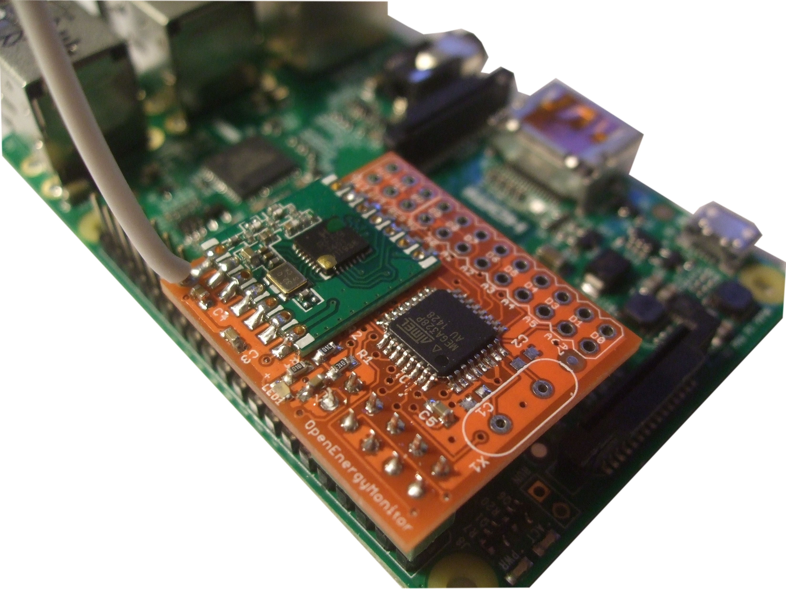
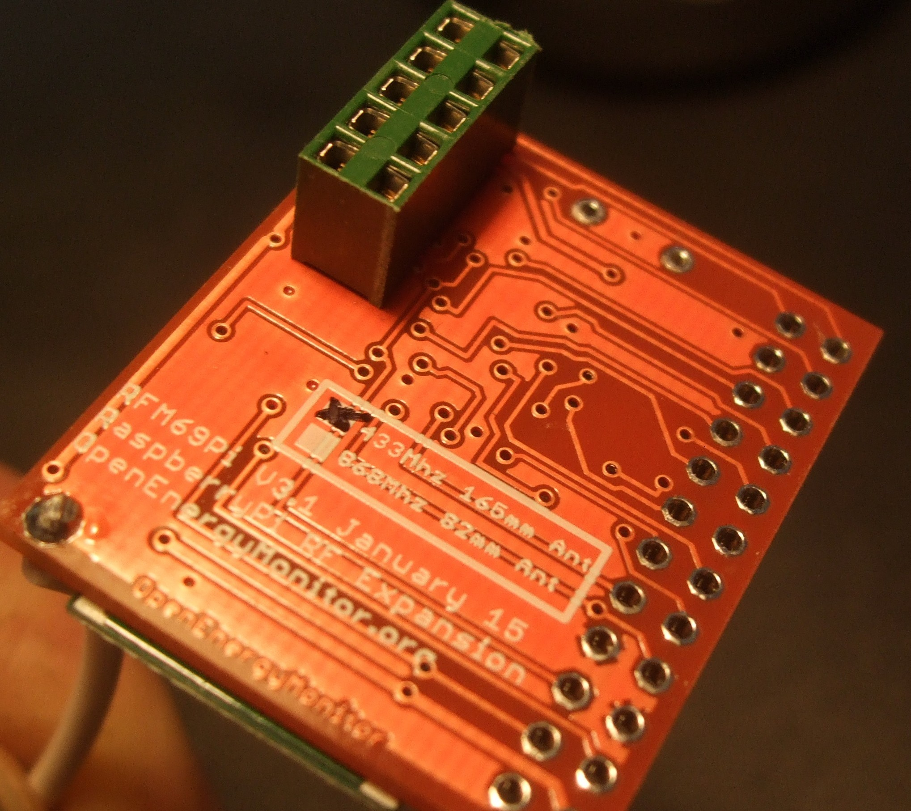
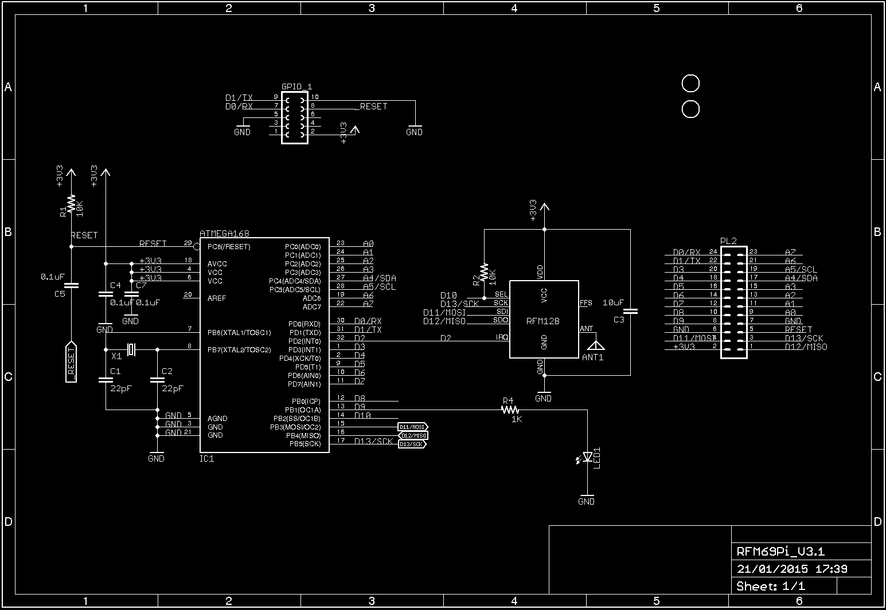
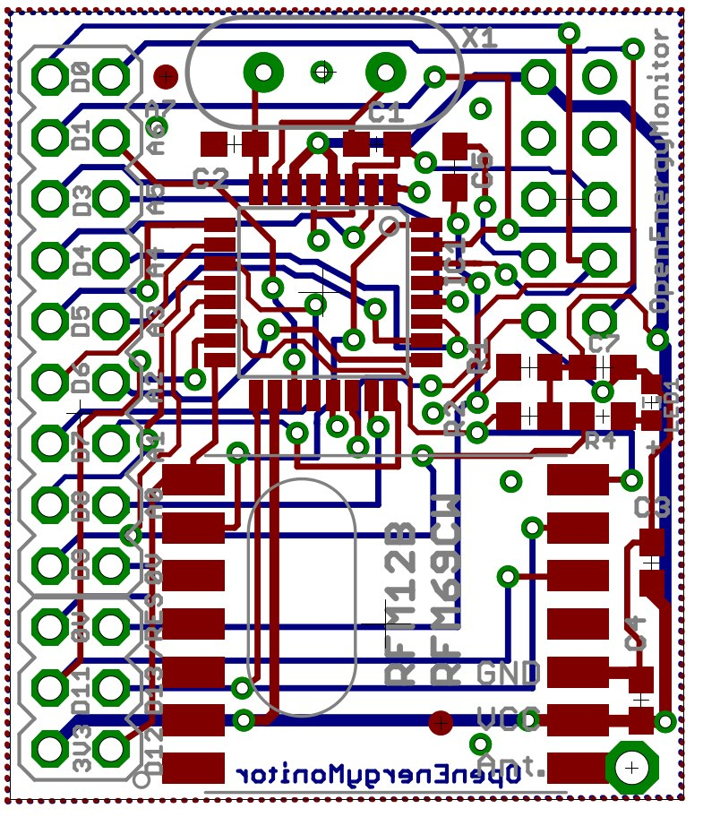

## RFM2Pi V3

Updated RFM12B / RFM69CW expansion board for the Raspberry Pi with ATmega328 I/O broken out. Developed with help from [Ken Boak](http://sustburbia.blogspot.co.uk/) 

http://wiki.openenergymonitor.org/index.php?title=RFM69Pi_V3

### Board

### Schematic and board: 

### Open Hardware

Hardware designs (schematics and CAD) files are licensed under the [Creative Commons Attribution-ShareAlike 3.0 Unported License](http://creativecommons.org/licenses/by-sa/3.0/) and follow the terms of the [OSHW (Open-source hardware) Statement of Principles 1.0.](http://freedomdefined.org/OSHW)
