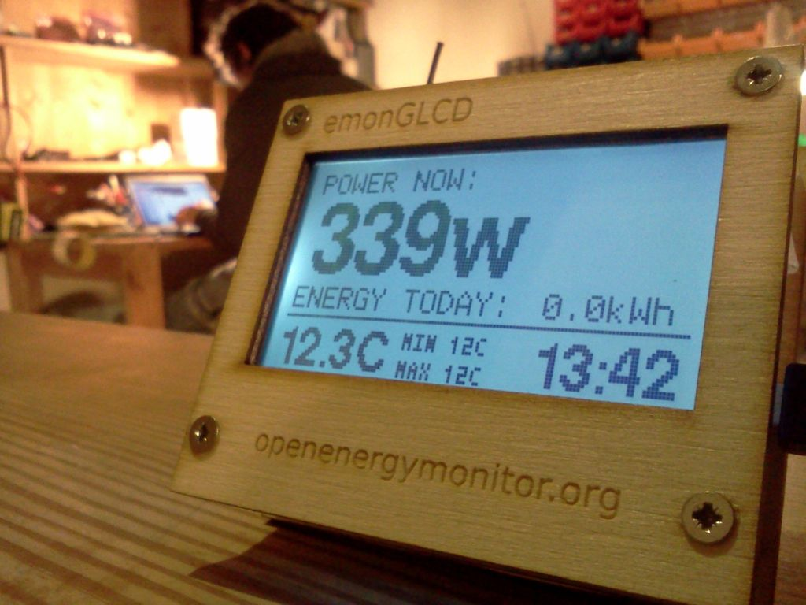
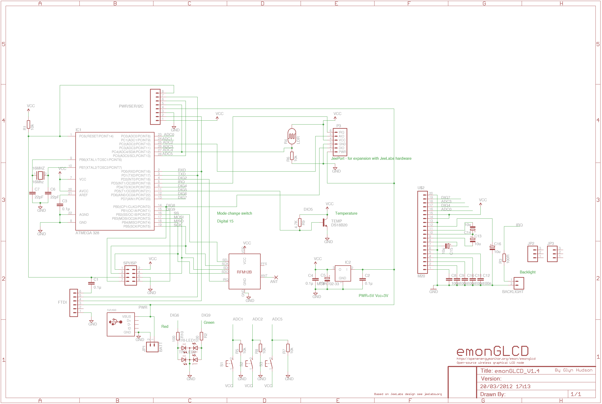
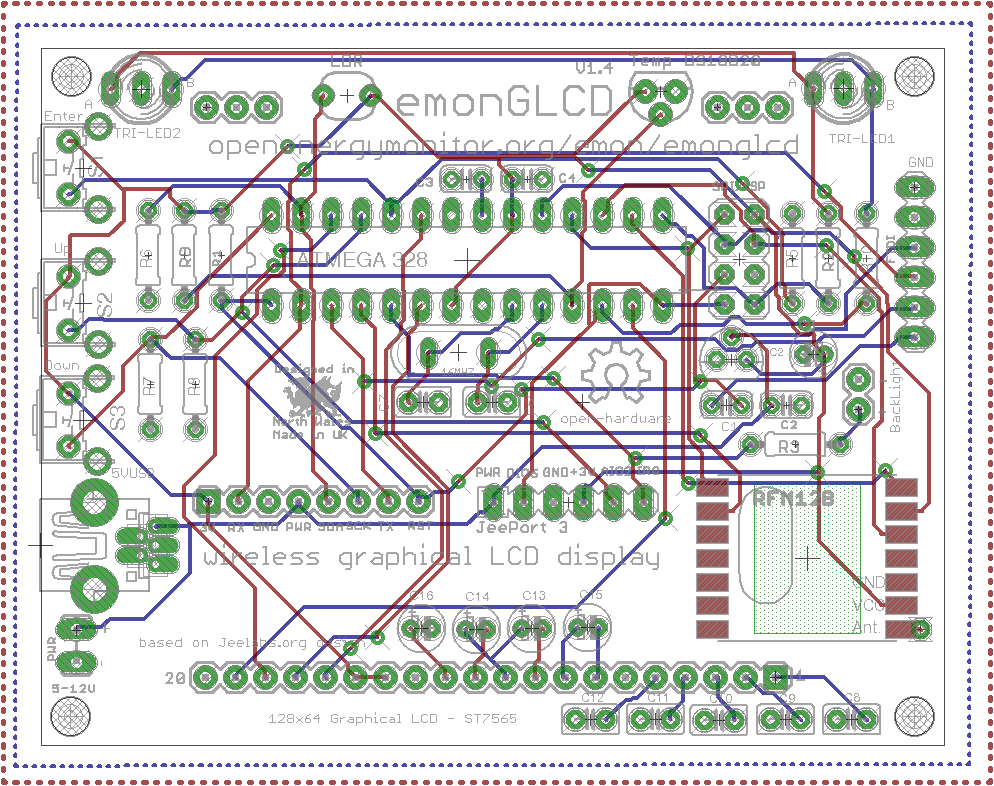

# emonGLCD V1

A general purpose wireless graphical LCD display unit. Powered by an Atmega328 with an Arduino bootloader.

The emonGLCD is designed to drive a 128x64 GLCD display based on the ST7565 driver. The board has a built in HopeRF RFM12B wireless module to receive data from the emonTx energy monitoring node or an emonBase (Nanode-RF web-connected basestation) which in turn could be pulled aggregated data from a web-sever to be displayed.

The emonGLCD has an on-board temperate sensor, light sensor and two tri-color ambient indicator LED's.

Based on JeeLabs.org design.

[http://openenergymonitor.org/emon/emonglcd]([http://openenergymonitor.org/emon/emonglcd])

[http://shop.openenergymonitor.com/displays/](http://shop.openenergymonitor.com/displays/)

### Schematic

### Board

### Open Hardware

Hardware designs (schematics and CAD) files are licensed under the [Creative Commons Attribution-ShareAlike 3.0 Unported License](http://creativecommons.org/licenses/by-sa/3.0/) and follow the terms of the [OSHW (Open-source hardware) Statement of Principles 1.0.](http://freedomdefined.org/OSHW)
