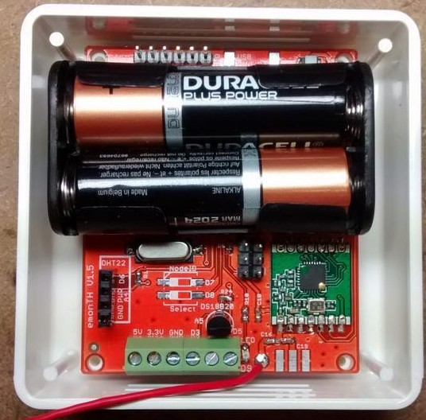
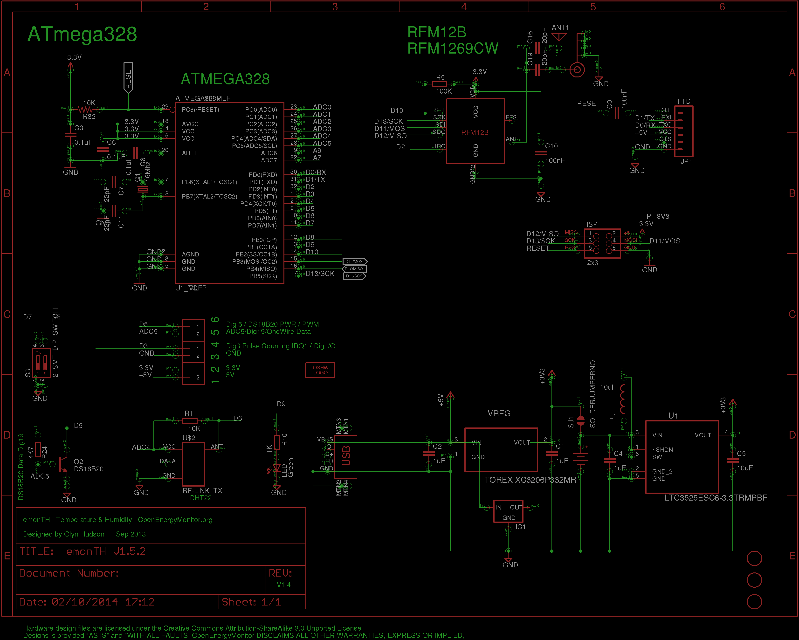
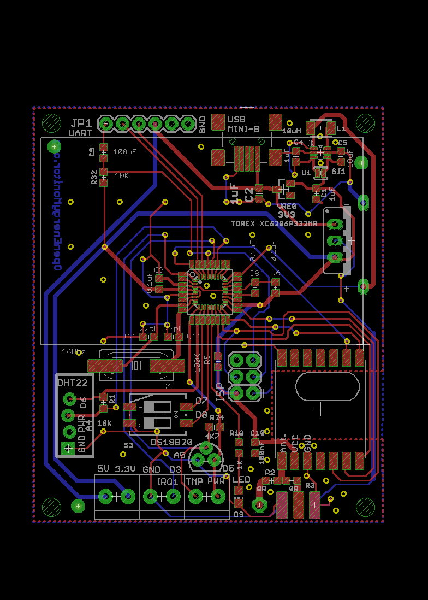

## emonTH V1.5

**Temperature and humidity monitoring noded**

Arduino compatible RFM69CW wireless low power temperature and humidity battery powered wireless node.

Documentation: [http://openenergymonitor.org/emon/modules/emonTH](http://openenergymonitor.org/emon/modules/emonTH)

### Schematic

### Board

### Open Hardware

Hardware designs (schematics and CAD) files are licensed under the [Creative Commons Attribution-ShareAlike 3.0 Unported License](http://creativecommons.org/licenses/by-sa/3.0/) and follow the terms of the [OSHW (Open-source hardware) Statement of Principles 1.0.](http://freedomdefined.org/OSHW)
