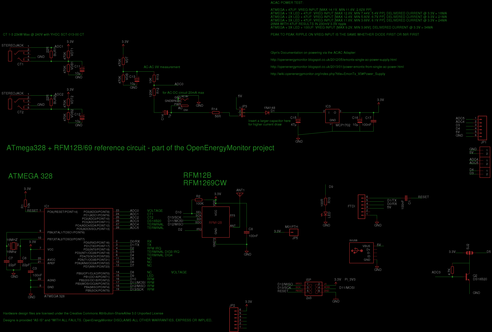
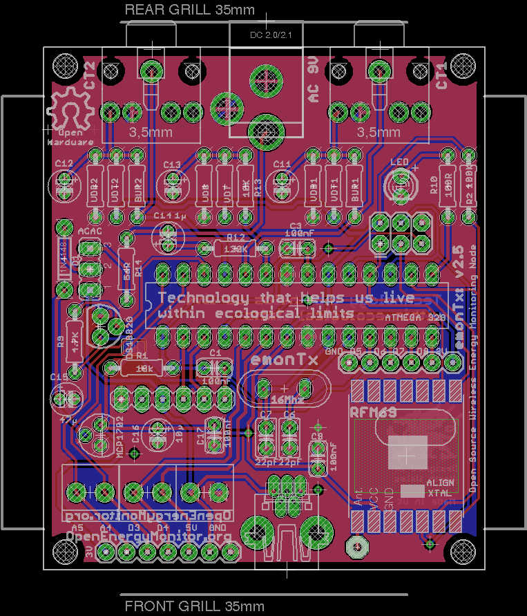

## EmonTx v2.5 Through Hole

An update for the emonTx v2.

Main features:

- 2x CT sensor inputs using higher quality 3.5mm jacks used on the EmonTx v3 and emontx shield
- 1x ACAC Voltage sensing and power input
- Terminal block power, ADC's and Digital IO breakout + full spare IO breakout.
- Onboard DS18B20 footprint
- Based around ATmega328 + RFM69 core
- Fits in emonTH enclosure

### Eagle schematic and board file

Download both the schematic and board file and open in eagle, click on File > Switch to Board to navigate between schematic view and PCB Board view.

- Schematic: [emonTx2.5.sch](emonTx2.5.sch)
- Board: [emonTx2.5.brd](emonTx2.5.brd)

### Schematic

### Board

### Open Hardware

Hardware designs (schematics and CAD) files are licensed under the [Creative Commons Attribution-ShareAlike 3.0 Unported License](http://creativecommons.org/licenses/by-sa/3.0/) and follow the terms of the [OSHW (Open-source hardware) Statement of Principles 1.0.](http://freedomdefined.org/OSHW)
