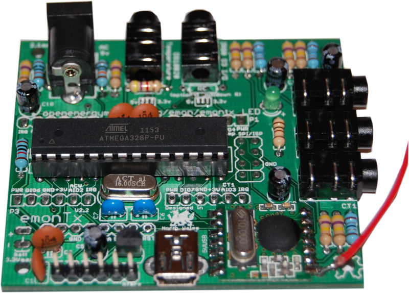
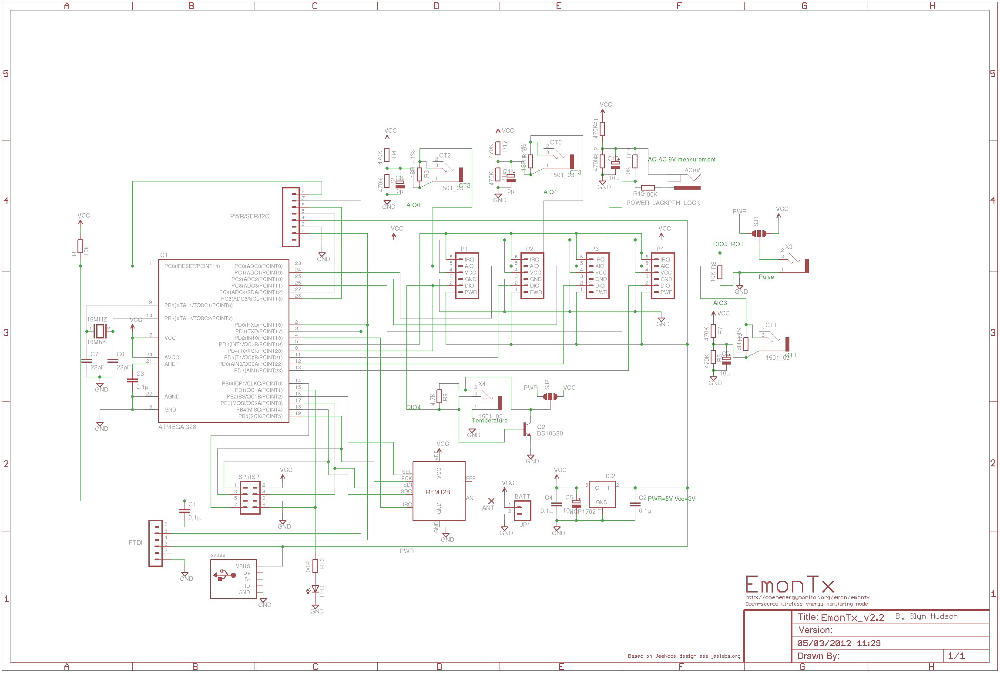
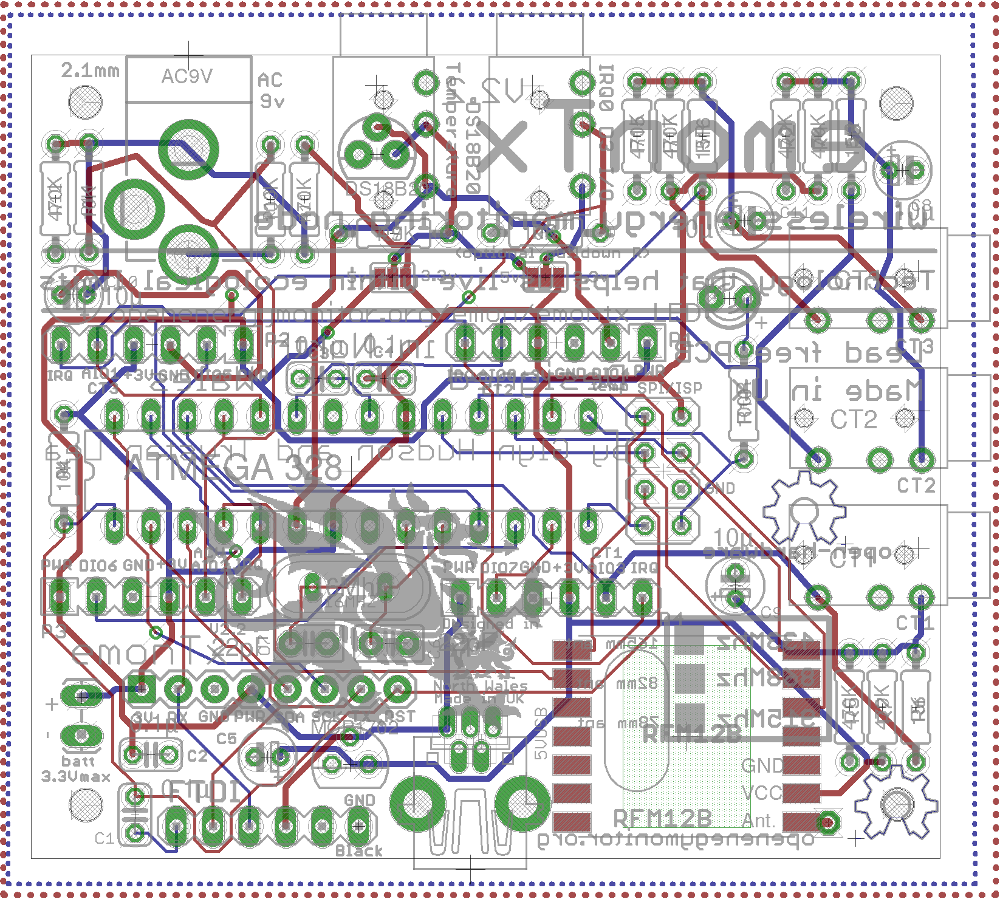

# emonTx V2

A a low power wireless energy monitoring node. Powered by an Atmega328 with Arduino bootloader.

It's designed to sense data from up to three CT current sensors, optically from a pulse-output utility meter and monitor temperatures from multiple digital temperature sensors on a one-wire bus. It's designed to be low power and can be powered by 2x AA batteries or 5V USB.

The emonTx is one part of the OpenEnergyMonitor end-to-end web-based energy monitoring system. The other parts being a graphical LCD wireless display (emonGLCD), web connected base station receiver (emonBase / Nanode-RF) and emoncms server based energy visualisation web application.

[http://shop.openenergymonitor.com/emontx-v3/]([http://shop.openenergymonitor.com/sensor-nodes/])

[http://openenergymonitor.org/emon/emontx](http://openenergymonitor.org/emon/emontx)

### Schematic

### Board

### Open Hardware

Hardware designs (schematics and CAD) files are licensed under the [Creative Commons Attribution-ShareAlike 3.0 Unported License](http://creativecommons.org/licenses/by-sa/3.0/) and follow the terms of the [OSHW (Open-source hardware) Statement of Principles 1.0.](http://freedomdefined.org/OSHW)
