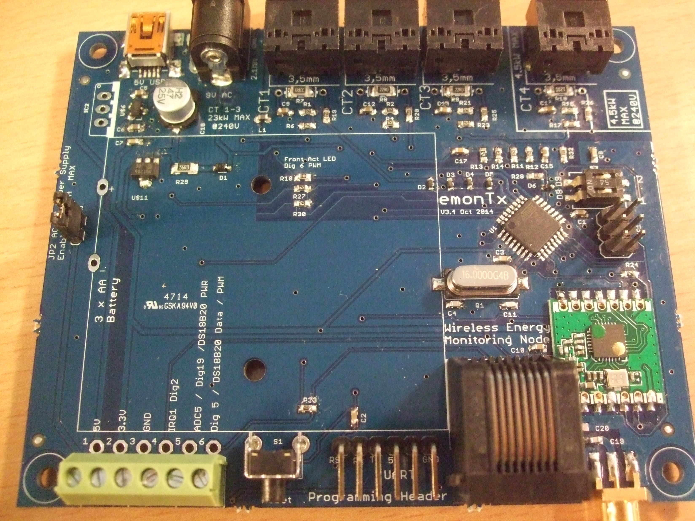
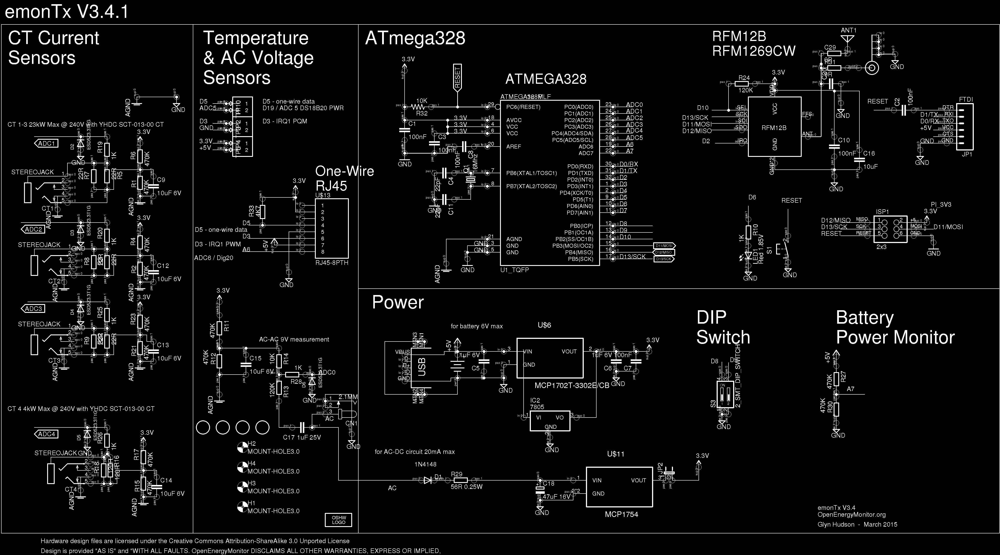
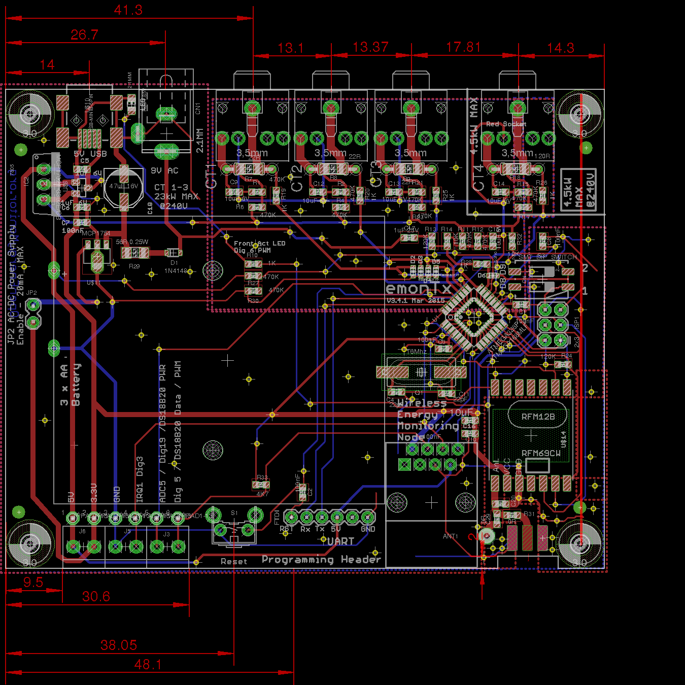

# emonTx V3.4.1

The emonTx V3.4 is the latest generation of the open-source hardware Arduino compatiable emonTx low power wireless energy monitoring node. The unit has been totally re-designed using surface mount (SMT) electronics to enable automated pre-assembled manufacture here in the UK.

## Change log

#### V3.4.2 Aug 2016

- Increase mini USB location pin holes from 0.8mm to 0.9mm

#### 3.4.1 Mar 2015

- lots of via GND links around GND plane - make sure ant has best GND plane possible
- make sure antenna has got GND plane under ant PCB trace
- pull top gnd plane in around RFM69CW module and rear GND plan to cover whole undersided
- Get rid of L1 - done
- Move D2 to be not under battery holder 
- correct terminal block silkscreen 
- disconnect RJ45 pin 1 and 3 from GND, stop power rail short if ethernet cable is mistake connected

#### V3.4 

- More FTDI connection bit to the left
- Increase pads for DIP switch
- Add TVS diodes, CT input protection

### V3.3 

- ATmega328 on-board
- Edge SMA Antenna
- Non plate through mounting pads to eliminate interference through enclosure
- RJ45 DS18B20 temperature sensor
- 3 x AA Battery monitor on ADC7
- DIP Switch on Dig8 and Dig9 for Node ID selection
- RFM69CW compatible with SEL line pull-up resistor
- Pulse counting / terminal block IRQ changed from D2 IRQ0 to D3 IRQ1 since RFM12B now uses IRQ0
- Changed MCP1700 3.3V regulator to MCP1702 3.3V regulator to allow for powering from higher voltages (12V max) over RJ45

[http://shop.openenergymonitor.com/emontx-v3/]([http://shop.openenergymonitor.com/emontx-v3/])

[http://openenergymonitor.org/emon/modules/emonTxV3](http://openenergymonitor.org/emon/modules/emonTxV3)

[http://wiki.openenergymonitor.org/index.php?title=EmonTx_V3.4](http://wiki.openenergymonitor.org/index.php?title=EmonTx_V3.4)

### Schematic

### Board

### Open Hardware

Hardware designs (schematics and CAD) files are licensed under the [Creative Commons Attribution-ShareAlike 3.0 Unported License](http://creativecommons.org/licenses/by-sa/3.0/) and follow the terms of the [OSHW (Open-source hardware) Statement of Principles 1.0.](http://freedomdefined.org/OSHW)
