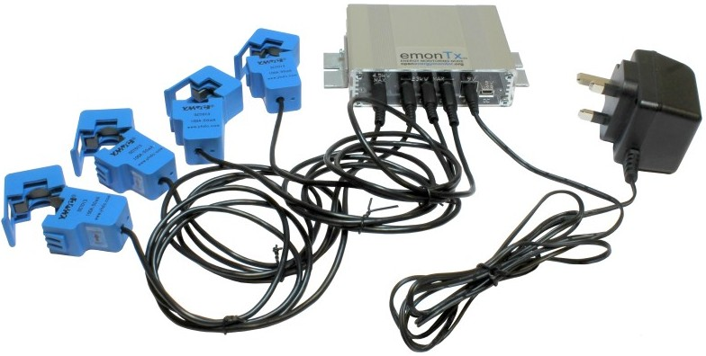

# emonTx V3
Open-source hardware Arduino compatiable emonTx low power wireless energy monitoring node.

[http://shop.openenergymonitor.com/emontx-v3/]([http://shop.openenergymonitor.com/emontx-v3/])

[http://openenergymonitor.org/emon/modules/emonTxV3](http://openenergymonitor.org/emon/modules/emonTxV3)

### Open Hardware

Hardware designs (schematics and CAD) files are licensed under the [Creative Commons Attribution-ShareAlike 3.0 Unported License](http://creativecommons.org/licenses/by-sa/3.0/) and follow the terms of the [OSHW (Open-source hardware) Statement of Principles 1.0.](http://freedomdefined.org/OSHW)
