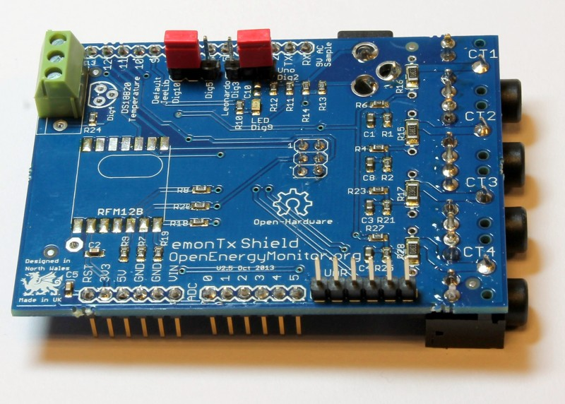
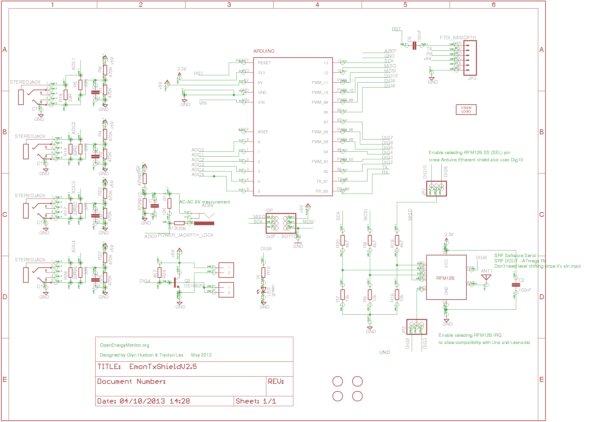
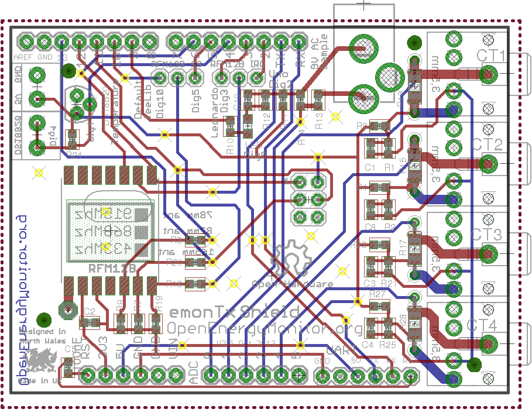

## emonTx Shield SMT

**An Arduino compatible energy monitoring shield**

An Arduino compatible energy monitoring shield, tested with Leonardo and Uno. With option for RFM12B wireless and DS18B20 temperature

Documentation: [http://openenergymonitor.org/emon/emontxshield/smt](http://openenergymonitor.org/emon/emontxshield/smt)

### Eagle schematic and board file

Download both the schematic and board file and open in eagle, click on File > Switch to Board to navigate between schematic view and PCB Board view.

- Schematic: [EmonTxShieldV2.5.sch](EmonTxShieldV2.5.sch)
- Board: [EmonTxShieldV2.5.brd](EmonTxShieldV2.5.brd)
- BOM: [bom.json](bom.json)

### Schematic

### Board

### Open Hardware

Hardware designs (schematics and CAD) files are licensed under the [Creative Commons Attribution-ShareAlike 3.0 Unported License](http://creativecommons.org/licenses/by-sa/3.0/) and follow the terms of the [OSHW (Open-source hardware) Statement of Principles 1.0.](http://freedomdefined.org/OSHW)
