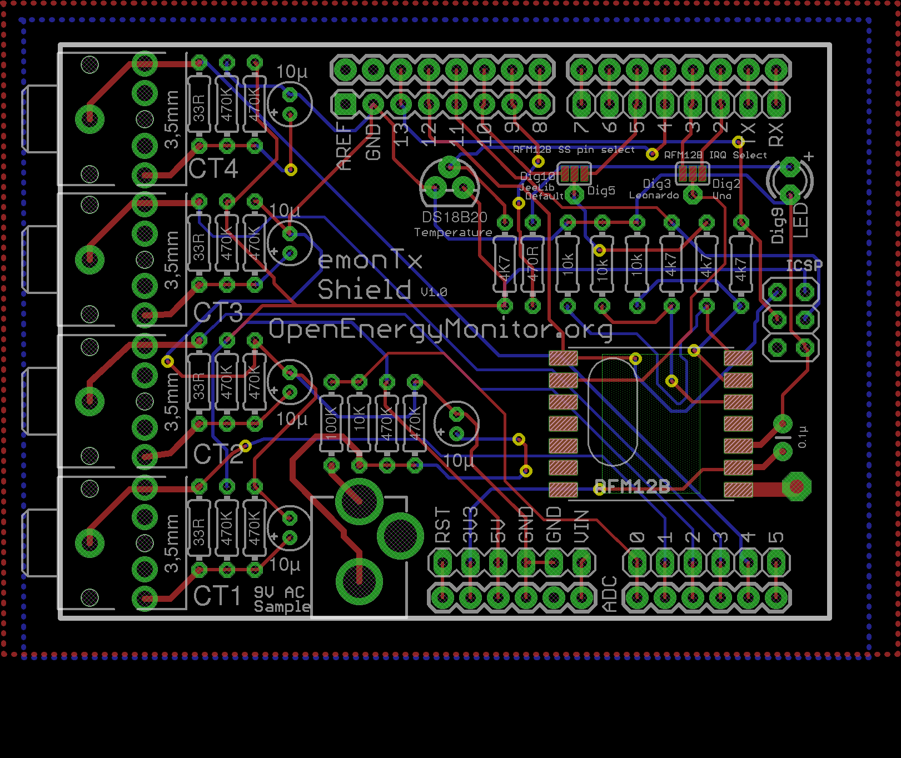

## emonTx Shield

**A wireless energy monitoring Arduino compatible shield**

An Arduino Uno and Leonardo compatiable shield with 4 x CT current sensor inputs, 1 x AC voltage sense input, RFM12B 433/868Mhz wireless and DS18B20 digital temperature sensor options.

The shield can un-non-invasively monitor apparent power, real power, power factor and AC RMS mains voltage.

Documentation: [openenergymonitor.org/emon/emontxshield](openenergymonitor.org/emon/emontxshield)

### Eagle schematic and board file

Download both the schematic and board file and open in eagle, click on File > Switch to Board to navigate between schematic view and PCB Board view.

- Schematic: [emontx-shield-v1.sch](emontx-shield-v1.sch)
- Board: [emontx-shield-v1.brd](emontx-shield-v1.brd)
- BOM: [bom.json](bom.json)

### Schematic

### Board

### Open Hardware

Hardware designs (schematics and CAD) files are licensed under the [Creative Commons Attribution-ShareAlike 3.0 Unported License](http://creativecommons.org/licenses/by-sa/3.0/) and follow the terms of the [OSHW (Open-source hardware) Statement of Principles 1.0.](http://freedomdefined.org/OSHW)
