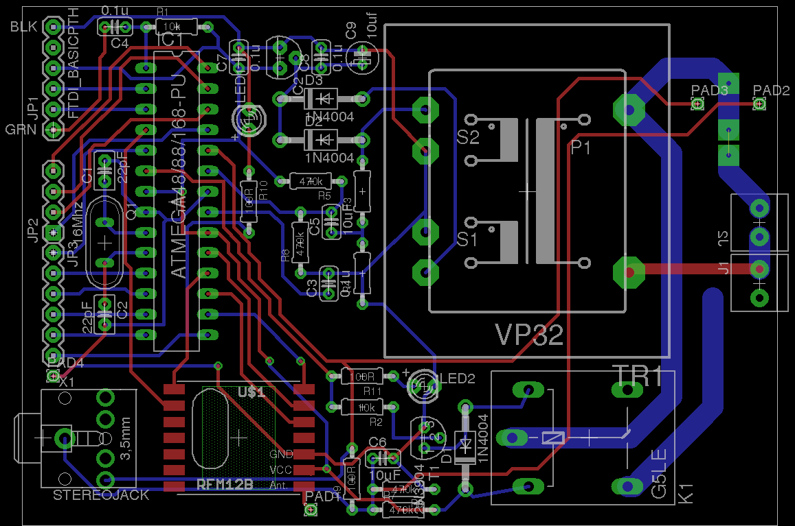
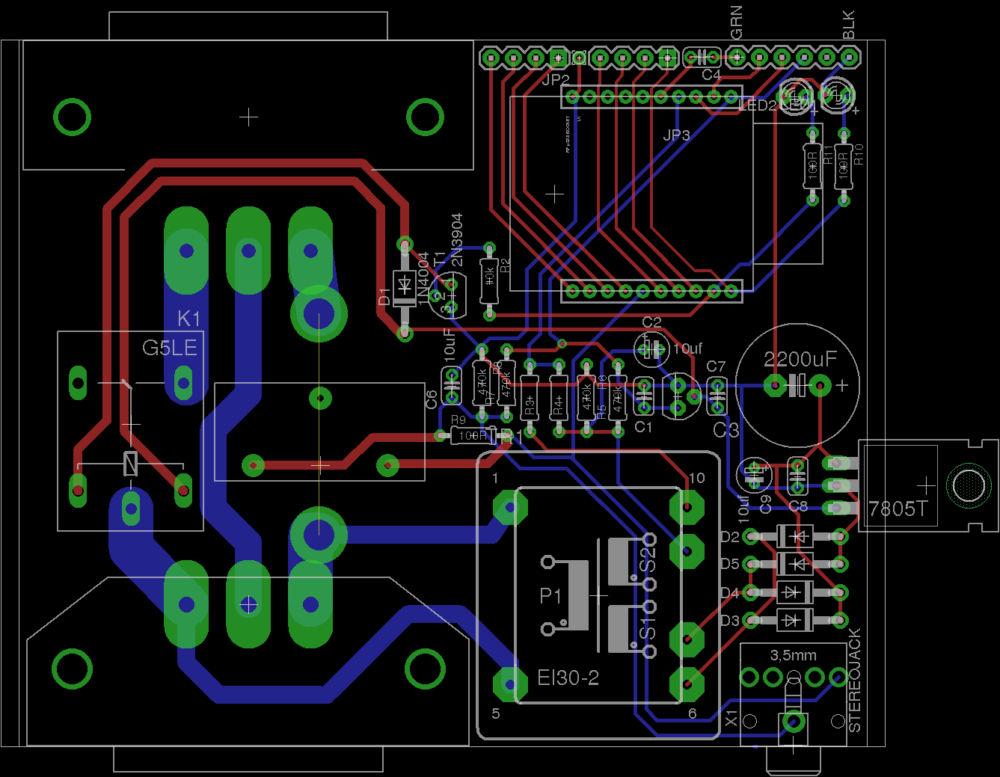

## Very early concept for a in-line plug energy monitor plus integrated relay for switching an appliance or plug bank on/off.

**Note:** This is an untested design in the early stages of development and involves high voltages on the board. If you use this design please ensure you independently check its suitability and safety.

### Atmega through-hole version

Download schematic: [relay-unit-atmega.sch](atmega/relay-unit-atmega.sch)

Download board file: [relay-unit-atmega.brd](atmega/relay-unit-atmega.brd)

### XRF through-hole version (further developed)

Download schematic: [relay-unit-XRF.sch](atmega/relay-unit-XRF.sch)

Download board file: [relay-unit-XRF.brd](atmega/relay-unit-XRF.brd)

### IET Socket's and CT

### Open Hardware

Hardware designs (schematics and CAD) files are licensed under the [Creative Commons Attribution-ShareAlike 3.0 Unported License](http://creativecommons.org/licenses/by-sa/3.0/) and follow the terms of the [OSHW (Open-source hardware) Statement of Principles 1.0.](http://freedomdefined.org/OSHW)
